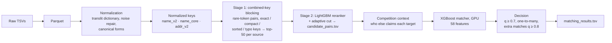

# TeamSlayer Submission
# Business Entity Resolution at Scale

**Linking 1.7M reference businesses to ~10M noisy records across three sources, three countries and 10+ writing systems.**

Built for the ML Challenge 2026 Business Entity Resolution track by **Team Slayer**.

| | |
|---|---|
| **Public leaderboard** | **0.966** macro-F0.5 (up from 0.949 on our first submission) |
| **Validation** (held-out entities) | **0.9802** macro-F0.5 |
| **Candidates per entity** | ~7 (reduction ratio > 0.99999 vs. all same-country pairs) |
| **Scale** | 2.2M S1 × 10.3M targets (train), 1.7M × 10.0M (test), on one 16 GB laptop |

---

## Table of contents
1. [The problem](#1-the-problem)
2. [Results](#2-results)
3. [Pipeline overview](#3-pipeline-overview)
4. [Key ideas](#4-key-ideas)
5. [What the data taught us](#5-what-the-data-taught-us)
6. [Repository structure](#6-repository-structure)
7. [Setup](#7-setup)
8. [Reproducing the results](#8-reproducing-the-results)
9. [Components in detail](#9-components-in-detail)
10. [Validation methodology](#10-validation-methodology)
11. [Experiment log](#11-experiment-log)
12. [Compliance](#12-compliance)
13. [Limitations and future work](#13-limitations-and-future-work)

---

## 1. The problem

Business identity data arrives from three independent sources with no shared identifiers:

- **Source 1 (S1)** is the deduplicated reference: one record per real business.
- **Source 2 / Source 3 (S2/S3)** contain noisy fragments of the same businesses, plus records that belong to no one.

For every S1 entity, find all S2/S3 records that describe the same business. An entity may match zero, one or many records.

**Scoring**: F0.5 per S1 entity, macro-averaged (precision weighted 2× over recall). A correctly empty prediction for an unmatched entity scores 1.0; any false match on it scores 0. A second, unscored criterion rewards **smaller candidate sets**, so blocking quality matters beyond the leaderboard.

**What makes it hard**

| Challenge | Example |
|---|---|
| 10 Indic scripts in targets (~25% of India records) | `आदित्य वेंचर्स प्राइवेट लिमिटेड` ↔ `Aditya Ventures Private Limited` |
| Encoding corruption | `Youngā\x80\x99s`, `lakeside�habitat` |
| Abbreviations, legal forms, word order | `Pvt Ltd` ↔ `Private Limited`, `physical partners therapy` |
| Digit-for-letter and typo noise | `hea1th c1inic`, `paras tdrnerts`, `6reat guild` |
| Concatenated / web-style names | `clyialsystems.com` ↔ `Clyial Systems` |
| Trade names | `Veoectoiri D.B.A. Pathways Entertainment` |
| **Generated distractors** | same name, house number shifted by 1–99, or `+ Holdings` / `Ltd → Pvt Ltd` |
| An unseen country in test | France appears only in the test set |
| Scale | ~23M records; all-pairs comparison is impossible |

---

## 2. Results

| Metric | Value |
|---|---|
| Validation macro-F0.5 (US + India) | **0.9802** |
| — singletons / matched entities | 0.975 / 0.981 |
| — micro precision / recall | 0.9965 / 0.951 |
| Public leaderboard | **0.966** |
| Candidate-set ceiling (perfect matcher on our candidates) | 0.993 |
| Candidate pair recall | 0.976 |
| Candidates per S1: validation / test | 6.65 / 7.7 (France 12.3) |

---

## 3. Pipeline overview



All heavy work runs in **DuckDB** (on-disk, chunked, bounded memory). String similarity uses **rapidfuzz**; models are **LightGBM** (reranker) and **XGBoost on CUDA** (matcher).

---

## 4. Key ideas

1. **Learn the transliteration, don't hand-code it.**
   Character-level transliteration turns `कंस्ट्रक्शंस` into `kmstrksms`, not `constructions`. Instead, we align Indic-script target names word-for-word with their English S1 names across ~1M training pairs and learn a token dictionary. Held-out accuracy: **97.5–99.2%** across all 10 scripts; 94% coverage on test.

2. **Combined keys beat single-token blocking.**
   Single tokens (`road`, `mumbai`, `solutions`) are too common to block on. Pairs of each record's rarest name and address tokens are rare enough to keep blocks small and specific enough to keep recall. Stage-1 recall went from 18% (single tokens) to 98% (top-50 per source).

3. **Two-stage candidate generation.**
   A cheap reranker re-sorts the top-50 stage-1 candidates, so we keep only ~7 per entity at a 0.993 recall ceiling. Smaller candidate sets rank higher in the challenge's secondary criterion.

4. **Score pairs in context, not in isolation.**
   Each target belongs to at most one S1. The matcher sees who else claims a target and how strongly, and whether a candidate agrees with the entity's other strong matches. This lifted unmatched-entity (singleton) accuracy from 0.84 to 0.97.

5. **Model the generator's distractors explicitly.**
   Audits showed that unmatched "distractor" records mostly differ from real matches by a shifted house number or an added/changed legal form. Features describing *how* numbers differ (shift vs. truncation vs. typo) added +0.004 on their own.

---

## 5. What the data taught us

Findings from audits on validation data that directly shaped the design:

| Finding | Evidence | Consequence |
|---|---|---|
| Matches never cross countries | 100% of true pairs share the country label | Blocking partitioned by country |
| Each target has at most one owner | 0 targets matched to 2+ S1 in 7.6M pairs | One-to-many assignment + competition features |
| Distractors shift house numbers | shift of 1–99 in **60%** of distractors vs **4.6%** of true matches | Number-difference-shape features |
| Distractors change legal forms | legal form changed/added in **60%** of distractors vs **7.6%** of true matches; `+ Holdings`, `+ Exports`, `+ Ventures` appear only in distractors | Legal-form transition features (future work v4) |
| True matches carry alias markers | `dba`, `aka`, `fka`, `t/a` appear only in true matches | Alias-aware similarity (future work v4) |
| Remaining misses are mostly generic name-only records | 57% of candidate misses have no address and a shared generic name | Largely irreducible by pairwise methods |
| No leakage in row order or IDs | correlation ≈ 0.001 | Nothing to exploit, nothing used |

---

## 6. Repository structure

```
.
├── src/
│   ├── normalize.py      # normalization: mojibake, transliteration, canonical forms, name_core
│   ├── keys.py           # builds normalized key tables for all sources (streamed, batched)
│   ├── blocking.py       # stage-1 combined-key blocking in DuckDB (chunked, memory-bounded)
│   ├── rerank.py         # stage-2 LightGBM reranker + adaptive cut
│   ├── features.py       # matcher features (FEATS_V3 used; FEATS_V4 implemented, future work)
│   ├── predict.py        # full-pool scoring, one-to-many decision, submission writer
│   └── metrics.py        # official per-entity macro-F0.5
├── notebooks/
│   ├── 00_dataset_audit.ipynb        # EDA + fixed validation split
│   ├── 01_translit_mining.ipynb      # learned transliteration + variant dictionaries
│   ├── 02_parquet_and_setup.ipynb    # TSV → Parquet, setup
│   ├── 03_train_pipeline.ipynb       # keys, reranker, train blocking, matcher training + validation
│   ├── 04_test_pipeline.ipynb        # test blocking, scoring, decision, output files
│   └── exploration/                  # audits and earlier iterations (not needed to reproduce)
├── artifacts/
│   ├── translit_dict.json            # learned script → English token map
│   ├── canon_mined.json              # learned variant → canonical maps
│   ├── rerank_lgb_c3.txt             # stage-2 reranker
│   └── matcher_xgb_v3_c3_big.json    # final matcher
├── utils/validate_submission.py      # official format validator (provided by the organizers)
├── Documentation_template.md         # full methodology write-up
└── requirements.txt
```

Not in the repository (regenerated by the notebooks or provided by the organizers): `dataset/`, `artifacts/parquet/`, `artifacts/keys_v2/`, `*.duckdb`, `output/`, and the validation split files.

---

## 7. Setup

**Requirements**
- Python 3.14 (developed on Windows 11)
- 16 GB RAM minimum; ~20 GB free disk for intermediate files
- Optional: NVIDIA GPU with CUDA for matcher training (CPU works, slower)

```bash
python -m venv .venv
.venv\Scripts\activate            # Linux/macOS: source .venv/bin/activate
pip install -r requirements.txt
```

**Data**: place the challenge files in `dataset/train/` and `dataset/test/` (tab-separated `.tsv`).

---

## 8. Reproducing the results

Run the notebooks in order. Each writes its outputs to `artifacts/` or `output/`.

| # | Notebook | Produces | Runtime* |
|---|---|---|---|
| 0 | `00_dataset_audit` | EDA, fixed validation split `notebooks/phase2_valid_gt.parquet` | ~5 min |
| 1 | `02_parquet_and_setup` | `artifacts/parquet/*` | ~5 min |
| 2 | `01_translit_mining` | `translit_dict.json`, `canon_mined.json` | ~15 min |
| 3 | `03_train_pipeline` | `keys_v2/`, `rerank_lgb_c3.txt`, train blocking, `matcher_xgb_v3_c3_big.json`, validation score | ~4 h |
| 4 | `04_test_pipeline` | test blocking, scoring, `output/matching_results.tsv`, `output/candidate_pairs.tsv` | ~3 h |

\*16-thread CPU, 16 GB RAM, RTX 5050 8 GB. Blocking dominates the runtime.

**Validate the output format:**
```bash
python utils/validate_submission.py \
    --matching output/matching_results.tsv \
    --candidate output/candidate_pairs.tsv \
    --test-dir dataset/test
```

**Memory tips**: if DuckDB runs out of memory, lower `threads` / `memory_limit` in `B.setup(...)` and raise `s1_chunks` in `run_blocking`. Every step is chunked, so smaller chunks always fit.

---

## 9. Components in detail

### 9.1 Normalization (`src/normalize.py`)
Applied identically to all sources:
1. **Mojibake repair** before Unicode normalization (NFKC would otherwise mangle the corrupted bytes).
2. **Learned transliteration** of whole non-Latin tokens, then **anyascii** as a fallback for unseen tokens and accents.
3. **Canonicalization**: legal forms and address abbreviations (hand rules + mined maps, composed so the result is idempotent), digit-for-letter repair (`hea1th` → `health`), number normalization (`03211` → `3211`, `n° 14` → `14`), web tokens, spaced acronyms (`l l c` → `llc`).
4. **`name_core`**: the distinctive part of a name. It strips legal forms and honorifics at both ends, trailing country noise, adjacent duplicates, and applies a light plural stem (`sarl maison comice et fils` → `maison comice`).

### 9.2 Stage-1 blocking (`src/blocking.py`)
Per country, for every record:
- select the 3 rarest name tokens and 4 rarest address tokens (rarity over the target pool, restricted to tokens that exist in the S1 vocabulary so typos aren't chosen);
- emit keys: token pairs (name×address, name×name, address×address), exact core, compact core, sorted-token core, and compact prefix/suffix keys with and without the house number;
- drop keys with more than 300 targets; score candidates by the sum of key IDF weights; keep the top 50 per source.

Everything is a DuckDB hash join or aggregate, processed in S1 chunks, target chunks and key-hash partitions, so memory stays within a fixed budget at any data size.

### 9.3 Stage-2 reranker (`src/rerank.py`)
LightGBM on 15 cheap features (key score and rank, Jaro-Winkler on core and compact names, containment, token overlap, shared numbers, missing-field flags). Candidates with p ≥ 0.003, at most 8 per source, form the final candidate set. That set is written to `candidate_pairs.tsv` and is exactly what the matcher scores.

### 9.4 Matcher (`src/features.py`)
XGBoost (depth 10, CUDA) trained on ~4M candidate pairs from 600k training entities. 58 features in seven groups:

| Group | Examples |
|---|---|
| Reranker / list context | p, rank, entity's max and sum of p, gap to its best candidate |
| Competition | number of S1 claiming the target, best competing claim, margin |
| Cluster consistency | similarity and house-number agreement with the entity's other strong candidates; near-duplicate "twin" count |
| Name similarity | Jaro-Winkler, token set/sort, WRatio, Levenshtein and partial ratio on compact names, phonetic skeleton, IDF-weighted overlap, legal-form agreement |
| Address similarity | token Jaccard with and without numbers, Jaro-Winkler, last-token agreement, postcode |
| Number shape | equal / log difference / digit edit distance / truncation of the house number |
| Artifacts | duplicated tokens in the raw name |

### 9.5 Decision (`src/predict.py`)
1. Keep pairs with q ≥ 0.7.
2. **One-to-many**: each target goes only to its highest-q entity.
3. Each additional match of the same entity needs q ≥ 0.8.
4. No candidate passes → empty prediction (full credit on true singletons).

---

## 10. Validation methodology

- **Held-out entities**: 441k S1 entities are never used to mine dictionaries or train any model. Scores are reported on a fixed 20k sample (69,252 true pairs).
- **Realistic competition**: during blocking, validation entities compete with all 2.2M train entities for targets, as test entities do.
- **Disjoint training sets**: the reranker (30k entities) and the matcher (600k) are trained on different entities, so the reranker's output is out-of-sample when it becomes a matcher feature.
- **Noise level**: the standard error on 20k entities is about ±0.0007; changes smaller than ~0.001 were treated as noise and not adopted.
- **Official metric**: `src/metrics.py` reproduces the challenge's per-entity macro-F0.5 exactly, including the singleton rule.

---

## 11. Experiment log

| Version | Change | Validation F0.5 |
|---|---|---|
| Reranker used as matcher | baseline | 0.929 |
| + one-to-many | | 0.933 |
| Matcher v1 | competition, list context, cluster features | 0.968 |
| Matcher v2 | IDF name overlap, address/number features, 3× data, GPU | 0.977 |
| Matcher v3 | number-difference shape, twins, sibling number agreement | 0.981 |
| **Final** | v3 features, final normalization, 600k entities, final rule | **0.9802** |

Tried and not adopted (within noise): deeper trees, other seeds, 2–3 model ensembles, alternative decision rules (separate top-1 thresholds, expected-F0.5 per entity), per-country thresholds, larger blocking caps.

Blocking evolution (stage-1 pair recall, top-50 per source): single rare tokens 0.32 → combined keys 0.97 → final 0.98.

---

## 12. Compliance

- **No external data**: no APIs, geocoders, business registries or internet lookups.
- **No pretrained models**: all models are gradient-boosted trees trained from scratch, far below the 8B-parameter limit.
- **Offline resources only**: `anyascii` is a static character table. The transliteration and variant dictionaries are learned from the provided training pairs.
- **Open-source dependencies**: XGBoost (Apache-2.0), LightGBM (MIT), DuckDB (MIT), anyascii (ISC), rapidfuzz (MIT), pandas / NumPy / scikit-learn (BSD-3), PyArrow (Apache-2.0).

---

## 13. Limitations and future work

**Limitations**
- **France is unvalidated.** There's no labelled French data; performance there relies on language-neutral features and a few generic rules.
- **Ambiguous records.** Name-only targets with generic names shared by several entities are often ambiguous by construction (~17% of contested cases carry no distinguishing signal).
- **Offline–online gap.** Test has ~20% more targets per entity than train (more unmatched records), which explains part of the gap between validation (0.980) and leaderboard (0.966).

**Next steps, with evidence from audits**
1. **Stage-2 matcher with competitor-relative features.** For contested targets, the true owner beats the wrong claimant on name, legal form or address in ~80% of cases. That signal isn't yet used directly.
2. **Feature set v4** (already implemented as `FEATS_V4`): legal-form transitions, learned log-odds of added/dropped name tokens, alias-aware similarity, IDF-weighted address overlap, raw formatting flags.
3. **More training data:** going from 300k to 600k training entities gave +0.0008; the full 1.7M is untested.
4. **A single `run.py` entry point** to replace the notebook sequence.

---

*Methodology details: see [`Documentation_template.md`](Documentation_template.md).*ne character table. The files in artifacts/ are regenerable from the training data by running the notebooks.
